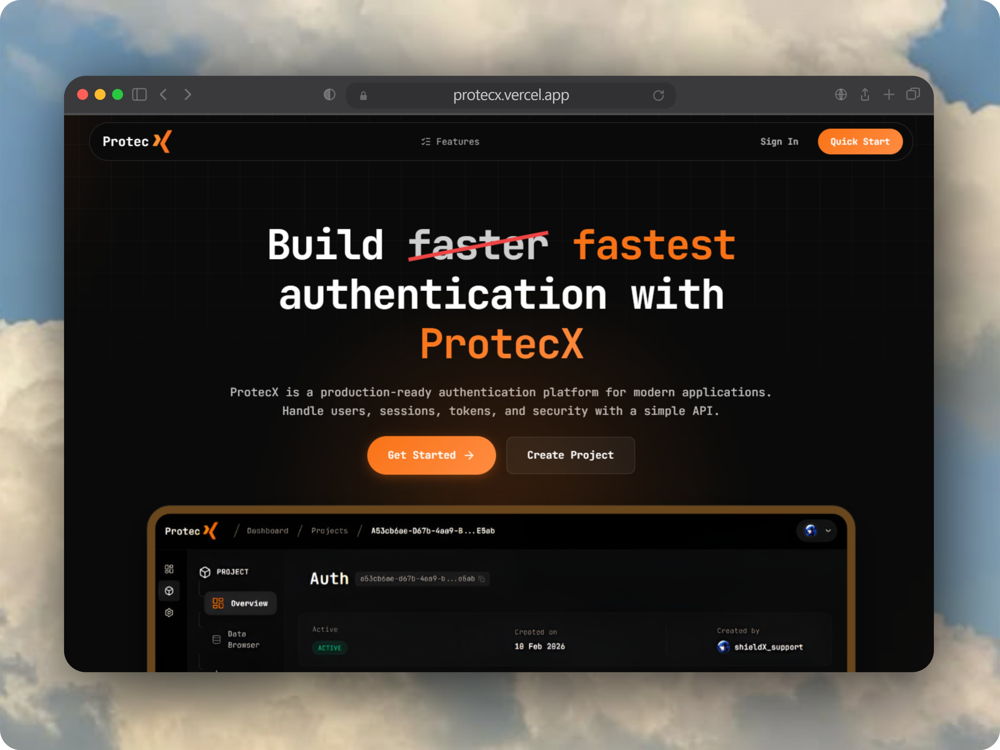

# : Auth as a Service
ProtecX is a powerful, distributed API security and authentication layer designed for modern developers. It provides a robust, scalable infrastructure for managing projects, user authentication, and secure API access using state-of-the-art technologies.



<br>

[](https://protecx.io)
[](https://opensource.org/licenses/ISC)

---

## Key Features

- Multi-Tenant Security: Manage multiple projects, each with its own isolated set of users, API keys, and JWT configurations.
- Advanced Key Management: 
  - Securely generate and manage **API Keys** for backend-to-backend communication.
  - **RS256 JWT** key generation and management for secure client-side authentication.
- Real-time Monitoring: Integrated logging system to track API usage, status codes, and errors across all your projects.
- High Performance: Built with a distributed architecture using **gRPC**, **RabbitMQ**, and **Redis** for low-latency communication and event-driven workflows.

---

## Architecture & Tech Stack

### Backend
- **Core**: Node.js & Express (TypeScript)
- **Database**: PostgreSQL with Prisma ORM
- **Communication**: gRPC for inter-service communication
- **Messaging**: RabbitMQ for asynchronous event processing
- **Caching**: Redis for session and rate limiting
- **Security**: Argon2 (hashing), JWT (signing), Google Auth

### Frontend
- **Framework**: React 19 (Vite)
- **State Management**: Redux Toolkit
- **Styling**: Tailwind CSS & Shadcn UI
- **Routing**: React Router 7
- **Interactive UI**: Lucide Icons, Canvas Confetti, Framer Motion (implied by design)

---

## Project Structure

```bash
ProtecX/
├── Backend/          # Node.js Express server
│   ├── src/          # Source code (Controllers, Services, Middlewares)
│   ├── prisma/       # Database schema and migrations
│   └── proto/        # gRPC protocol buffer definitions
├── Frontend/         # React Dashboard
│   ├── src/          # React components, pages, and store
│   └── public/       # Static assets
└── README.md         # Project entry point (this file)
```

---

## Getting Started

### Prerequisites

- Node.js (v18+)
- PostgreSQL
- Redis
- RabbitMQ

### Configuration

1. **Clone the repository**:
   ```bash
   git clone https://github.com/himudit/ProtecX
   ```

2. **Backend Setup**:
   ```bash
   cd Backend
   npm install
   # Create .env file and fill in your DATABASE_URL, REDIS_URL, RABBITMQ_URL, etc.
   npx prisma generate
   npx prisma db push
   npm run dev
   ```

3. **Frontend Setup**:
   ```bash
   cd ../Frontend
   npm install
   # Create .env file and set VITE_API_BASE_URL
   npm run dev
   ```

---

## 📖 API Documentation

Detailed API documentation, including endpoint descriptions and request/response formats, can be found in the [Backend README](Backend/README.md).

---

## 📄 License

This project is licensed under the **ISC License**. See the `LICENSE` file for more details.

---

<p align="center">
  Built with ❤️ by the  ProtecX Team
</p>
